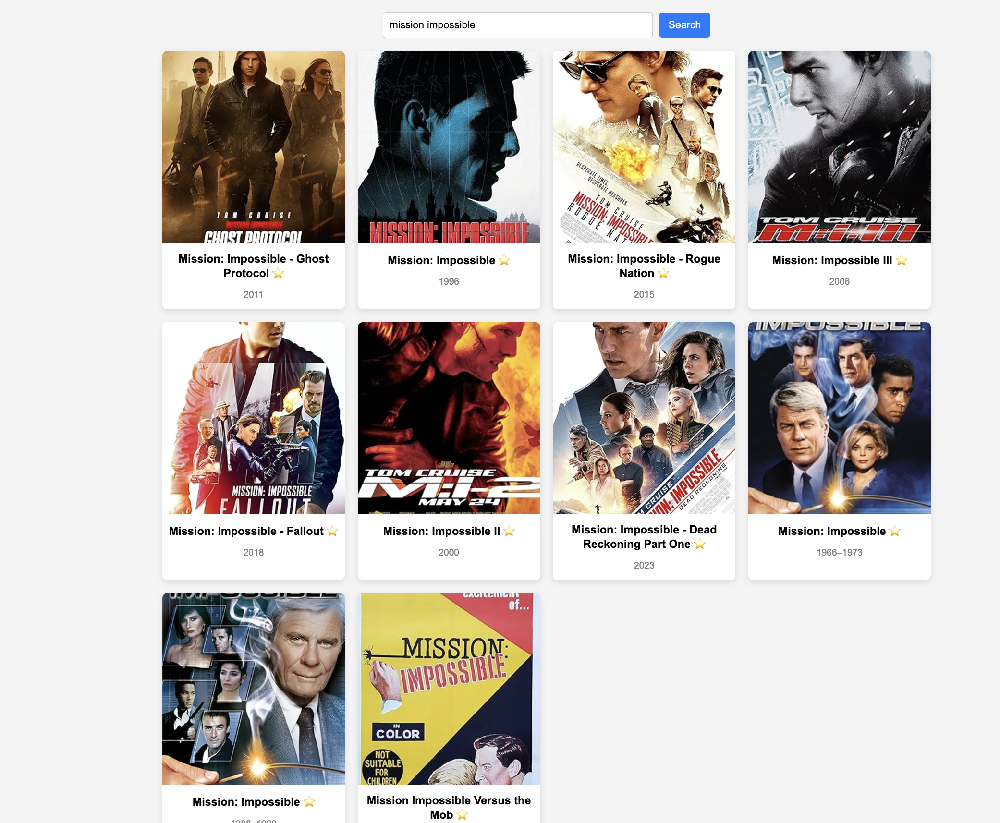
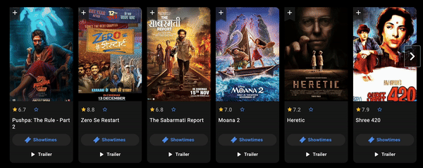

# Movie Rating App using React and any state management library

1. Make an API call to (`https://www.omdbapi.com/?s=time&y=2024&apikey=your_api_key`) fetch All the movie of 2024 with title name time and then render the movie posters.
2. Each Row should contain only 4 Movies (Ex:- If there are 10movies total, then you should render 3 rows, R1-4, R2-4 and R3-2).
   
3. You should place an searchBar as well for Searching the Movie, and you should fetch the movie from (`https://www.omdbapi.com/?s=${searchTerm}&apikey=${apiKey}`;)
4. Once Movies are fetched then render them according to step2, if no results are found then you should show "No Results for {Searched Query}".
5. Each Movie Card should render with Image, Movie Name, and With Empty Star.
6. When Empty Star is Clicked, you should open a Dialog to Rate That Particular Movie, Something like Attached Screenshot.
   

7. On Star Rating Dialogue:-
   a. If max star is 10, then you should render 10 empty star.
   b. if you hover over the star, then that star should get replaced with filled-star and vice-versa.
   c. If you have clicked on 7th star, then all the stars from 1-7 should get rendered with filled-star, and remaining 3 with the empty star.
8. Once Rating is given for the movie, then that movie card should render filled star.
9. If we click on filled-star again, then dialog should render with previous selected star.

- **Bonus:**
- a. Making the Page Responsive
- b. Writing Unit Test Cases

> **OMDB_API_KEY**: [!Note]- 4a41b347

> **_NOTE:_** You can find the star.svg and filled-star.svg in public folder, to store the rating you can use localstorage.

InterviewerComment :-
only *On Star Rating Dialogue* left because i am using material-ui popup and it gives some modules error and then i try to create my own popup in Cart2 component but unable to do so.
i know the logic how it works i.e->
when click on rating star button and to rate the movie will use css to render filled stars and onClick button to save the rating of movies and store it in any variable using useState or by creating redux store with other necessary details of movies.
and when view the rating using data stored value to render the rating.

Thanks.
